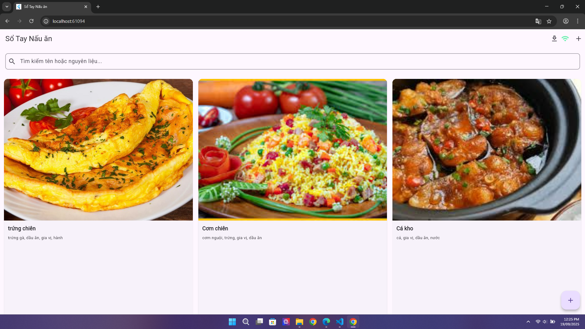
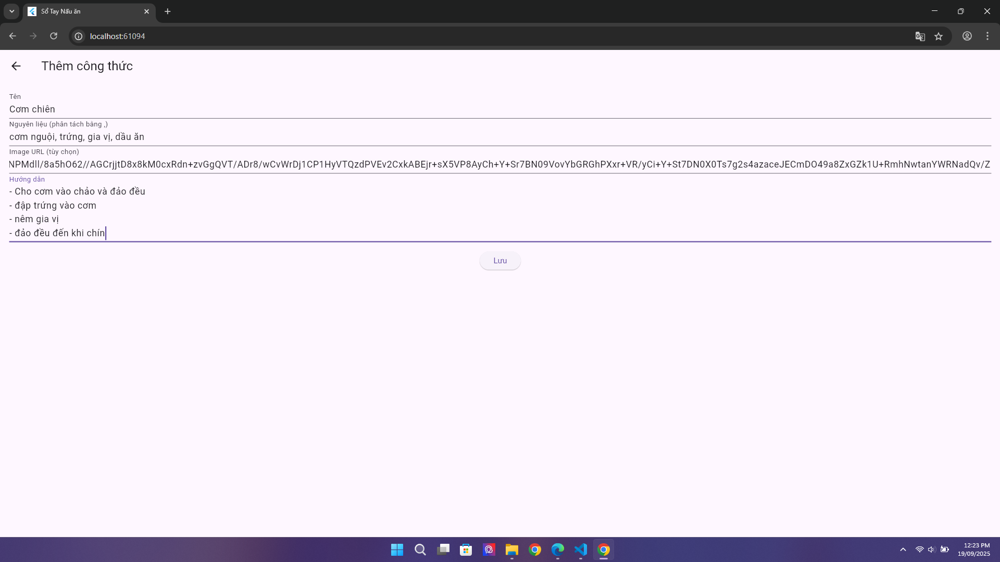
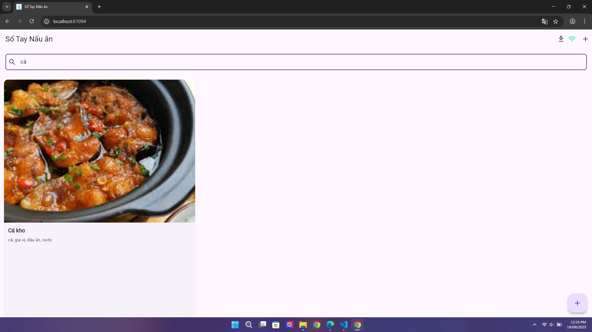

# flutter_recipe_book

Chủ đề PWA : 
Recipe Book: Lưu trữ công thức nấu ăn: thêm, sửa, xóa công thức, hỗ trợ tìm kiếm nguyên liệu.
- Đây là các yêu cầu kỹ thuật: 
+ Triển khai frontend bằng HTML, CSS, JavaScript/Framework (React, Vue, Svelte).
+ Dùng để hỗ trợ offline, cache assets.
+ Dùng để lưu dữ liệu cơ bản. 
+ Xử lý logic bằng flutter

Giao diện và chức năng chính của trang web:
- Trang chủ:
  
- Thêm:
  
- Sửa:
  
- Xóa:
  
- Chi tiết:
  
- Tìm kiếm:
  
